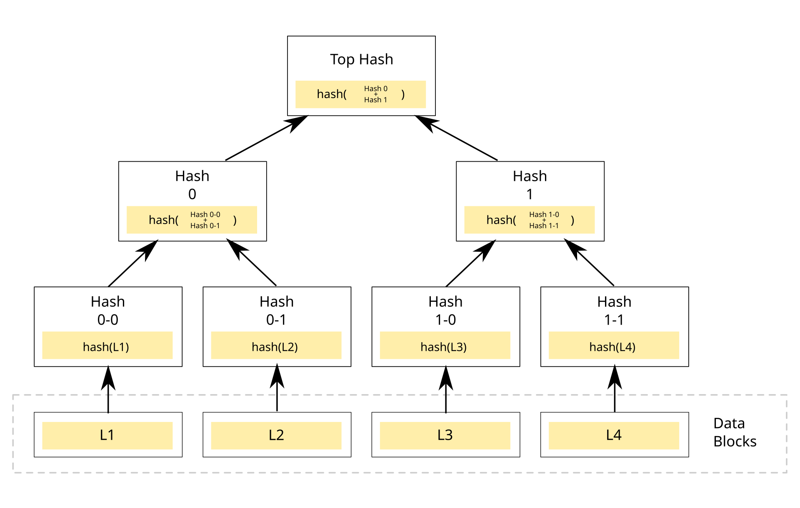
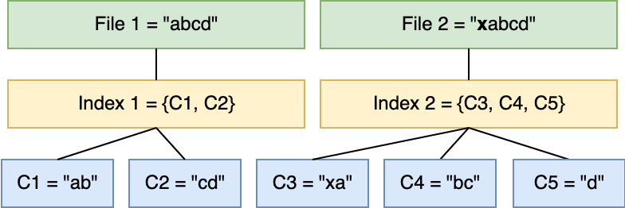
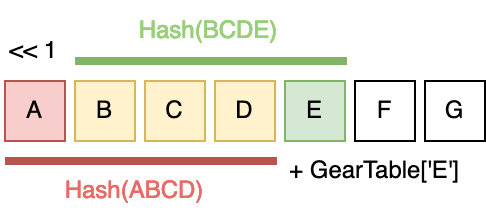
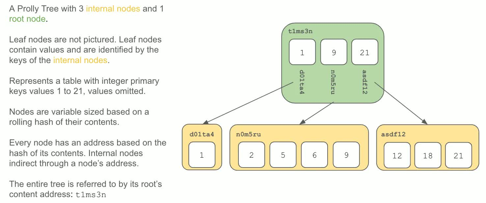

# Construction

<!-- TODO update after I've written a bit more abourt deltas -->
One of the biggest issues with state-based CRDTs is that the entire state needs to be shared in order to merge. This is fine with smaller states such as a number, but if the state is a list with thousands or millions of items it will quickly become prohibitive.
The problem is addressed by $\delta$-CRDTs, but those require more complex infrastructure.
Can we do better? Prolly trees provide a solution for ordered key-value map CRDTs that embeds information about what changed directly in the data structure itself.
Here is how to construct one in stages.
<!-- TODO not amazing wording but good to say that we're doing key-value store. -->

## Hashing and content addressing

We can use _hashing_ to reduce the communication cost of equality checks.

A _hash function_ is any function $H : \{0,1\}^* \to \{0,1\}^m$, mapping inputs of arbitrary length to some fixed length $m \in \mathbb{N}^+$. (We can represent all data as a sequence of bits, though will practically consider larger units such as bytes.)
A _collision_ in a hash function $H$ is a pair of inputs $x, y \in \{0,1\}^*$ such that $H(x) = H(y)$ but $x \neq y$.
A very simple hash function could e.g. map all inputs to the output of 0, but that's not very useful.
We are interested in functions with small chance of collision.

::: {#def-collision-resistance}

### Collision resistance

A hash function $H$ is _collision-resistant_ if it is infeasible for any probabilistic polynomial-time algorithm to find a collision in $H$ [@intro-modern-crypto-3rd, p. 168].^[This is an informal definition --- a proper one relies on _keyed_ hash functions (which are academically studied but not relevant to our use) and a definition of probabilistic polynomial-time algorithms. See the textbook for the full treatment.]
This implies that its output seems random and is hard to predict or backsolve: given the hash, there's no good way to figure out what input it came from besides just trying a bunch of inputs.
:::

(A note on terminology: the word "hash" is overloaded. You hash _(verb)_ some input with a hash function _(noun)_ and the output is the hash _(noun)_ of the input.)

There necessarily are collisions in a hash function, even a collision-resistant one: since the output space is finite and the input space is infinite, an infinite class of inputs are pidgeonholed into the same output.
For our purposes, we'll ignore the chance of collisions. SHA-256, a ubiquitous cryptographic hash function, has $2^{256}$ bits of output and there are no known collisions even after decades of analysis.^[
There have been various attacks on reduced-strength versions of these hash functions: see @hashcrack1, @hashcrack2, and @hashcrack3 for the state of the art as of writing this.]
Even if it were a problem, we could use an additional hash function to supplement the original, swap out SHA-256 for an entirely new hash function with larger output space (like SHA3-512), or do many other things.
So from here on out, we'll assume that we have access to a collision-resistant hash function $H$ whose output is large enough that if $H(x) = H(y)$ then $x = y$ except with unimaginably small chance.

With that assumption, hashes let us cheaply check equality. If $H(x) = H(y)$, then $x$ almost always equals $y$. So if two nodes wish to compare their data, they can simply hash the entirety of their data and only share the hash. If the value is the same, then by our above assumption they have the same data and don't need to communicate further. If they don't have the same hash, then they'll need to share the full CRDT's state as usual.

<!-- TODO example images for this? (and likely the others too) -->

_Content-addressed storage_ is a database that supports efficient queries via the hash of the desired content. So given a hash $h$, it will return the data $x$ for which $H(x) = h$ (assuming that that data has been previously put into the storage).
One way to do this is with hash tables --- with an array of size $n$, you store $x$ at index $h \mod n$. This table can have its own collisions, which can be fixed in many ways; for our purposes we will let other programs deal with that, and assume we have access to content-addressed storage that correctly retrieves data from its hash.

Content-addressed storage is immensely useful in distributed systems because it provides a clear way to concisely reference data. Normal computer programs can do this with pointers, but those reference a location in memory that is specific to the program being run and the device that it's on. A hash is defined by the data it points to and will always be the same, no matter what machine calculates the hash. This means it can be used as a stable, cross-machine pointer to a block of data.
Prolly trees have a lot of data that we want to reference by hash; content addressing means we generally only need to deal with hashes, and can easily get the content when desired.

## Merkle trees

What if we have a lot of data to store? Should we take a hash of everything at once? But then if any small part changes, two hashes between nodes will be different and they'll still have to transmit the full data. And if we hash a bunch of data blocks individually, we'll have to manage $n$ individual hashes. There's a better way to organize everything together.

::: {#def-merkle-tree}

### Merkle tree

A _Merkle tree_ is a tree of hash pointers to other hash nodes, ending in leaves of actual data that is verified by the hashes [@merkle-tree].

:::

To construct a Merkle tree, start with some data (e.g. a series of files). For each data block $x_i$ (e.g. each file), compute its hash $h_i = H(x_i)$. Then construct a binary tree from the bottom up, recursively hashing pairs of hashes. For example, the parent of $h_1$ and $h_2$ (denoted $h_{1,2}$) stores $H(h_1||h_2)$, the hash of $h_1$ concatenated with $h_2$. And then its parent $h_{1,2,3,4} = H(h_{1,2}||h_{3,4})$, and so on. Eventually this leads to a single hash, called the root hash since it's at the root of the tree.
Taking hashes of hashes in this way maintains collision resistance --- it is still computationally infeasible to find a collision in two Merkle tree root hashes.
<!-- (If the number of blocks is not a power of two, we can add padding at the end or have an uneven tree.) -->

<!-- By Azaghal - Own work, CC0, https://commons.wikimedia.org/w/index.php?curid=18157888 -->

Merkle trees solve our problem of hashing large amounts of data. Assume that our state-based CRDT has some way to represent its current state in an ordered way, e.g. a binary string. Furthermore, assume that this representation is unique for a given state. Then we can construct a Merkle tree on e.g. 1-kibibyte chunks of its data. This is a bit of extra storage, but not much --- we store about two hashes for every 1KiB, which is roughly 6% extra storage space.
And the benefits are dramatic.

To explain, say that two nodes $A$ and $B$ wish to compare states. Each constructs a Merkle tree on their data, which for this example has four leaves. Notate $A$'s root hash as $a_{1,2,3,4}$ and $B$'s root hash as $b_{1,2,3,4}$.
Now $A$ and $B$ share their root hashes. If they are the same, then (with overwhelming probability) their data is the same and thus the states are the same.
And if the hashes are different, the states are different --- but we can find _where_ they differ. If $a_{1,2,3,4} \neq b_{1,2,3,4}$, then $A$ and $B$ can share the next layer's hashes: $a_{1,2}$, $a_{3,4}$, $b_{1,2}$, and $b_{3,4}$. (All of this data lives in our content-addressable storage for easy retrieval.) If $a_{1,2} = b_{1,2}$, then that section of the Merkle tree is the same, so we don't need to go further down that path: the Merkle tree structure means that all the data in that subtree is identical. So $A$ and $B$ will only have to compare data in the right subtree where $a_{3,4} \neq b_{3,4}$. This process can recurse all the way down the tree until both nodes have a list of the leaf hashes that differ, which tells them what data they need to actually share. In the worst case, every hash differs between the two nodes and both need to share their entire states. But when only a small amount of data has changed, a Merkle tree means that they may only need to share a small amount of data, which immensely reduces the communication cost of merging states.

All of this relies on a standard way to represent and order the data. In some domains, such as tracking modifications to a large file, there is a natural way to do this. But some domains are harder. For example, if a CRDT implements an approximate Set ADT, how should its data be represented for the Merkle Tree? Sets don't have inherent order. There needs to be some representation that is unique to the abstract state, not just the internal state.
Prolly Trees represent a key-value mapping with some ordering on the keys, and we'll use that to create a consistent data representation.
<!-- TODO don't love that but should move on. -->
<!-- TODO should I just drop the hard cases? We only care about Prolly Trees. -->

## Rolling hashes

<!-- ALT TITLE: Content-defined chunking -->

The scheme we just described has a big problem. What if data is added to the start? For example, say our List CRDT for a file serializes as a list of its values and some node adds data to the start of the file. This necessarily changes the hash of the first block in the Merkle tree, but has cascading effects --- all the data shift down the line a bit, meaning that all chunks suddenly have new hashes. So our Merkle tree hash comparison would see that the nodes need to transmit all of their state, even though just a little bit has changed.
This doesn't affect correctness, but can ruin our performance gains from using the Merkle tree comparison scheme. We want a way to have the Merkle tree improvements in most cases of data insertion, not just when new data is appended to the end.

<!-- TODO example (with image?) of this issue? -->
<!-- https://joshleeb.com/posts/content-defined-chunking.html -->
<!--  -->

Generally, _chunking_ is the process of breaking up a large sequence of data into smaller blocks, or chunks.
What we did initially with the Merkle tree is fixed-length chunking: draw a dividing line every $k$ bytes and those are the blocks. This is a decent deduplication system, but as shown above it doesn't take full advantage of data similarity. _Content-defined chunking_ (CDC) attempts to fix this boundary-shift problem by determining chunk boundaries (when to draw a line between chunks) based on the actual contents being chunked. It doesn't fix the duplication problem entirely, but good CDC is reasonably efficient and reduces the problem when new data is inserted.

A _rolling hash_ is an efficient tool for CDC. Unlike hash functions we covered earlier, these are not collision-resistant --- but they don't need to be. Instead, they compute a random-seeming (but deterministic) value of a sliding window of data and can efficiently add new bytes to the input. One such rolling hash is the Gear hash introduced by @ddelta.
Notate our input data to be chunked as $B$, with $B_i$ the $i$th byte. Then $H_i$, the rolling hash up to byte $i$, has the following recursive definition:
\begin{align*}
H_0 &= 0; \\
H_i &= (H_{i-1} \ll 1) + \textsf{GearTable}[B_i].
\end{align*}
Given the rolling hash up to the previous block, we shift those bits up by one (losing the top bit) and then add some constant from a lookup table called the \textsf{GearTable}. That table is simply a mapping from bytes to randomly-generated integers, constant across all uses of the rolling hash. And to determine whether to draw a chunk boundary after byte $i$, check the top $k$ bits of $H_i$; if they're all $1$ then make a chunk boundary and restart the hash at 0 after the boundary, otherwise keep going. (This is called the judgment function.)

As long as the \textsf{GearTable} is randomly created and we're not too unlucky, the values of $H_i$ will be roughly uniform and the chance of the top $k$ bits all being one should be $\frac1{2^k}$.
So to have chunks of average size $1$KiB, we'd set $k = \log_2(1024) = 10$. 
TODO explain how this alleviates the chunk-boundary-shift problem.

<!-- FIXME I don't have the license for this or some other images -->
<!-- https://joshleeb.com/posts/gear-hashing.html -->
<!--  -->

There are further improvements to this scheme, such as in @fastcdc where the deduplication ratio and distrubution of chunk sizes is greatly improved, but we won't go into the details of modern constructions. All that is important for the Prolly Tree is that we have access to some chunking strategy that is efficient and usually won't cause a cascading effect of chunk boundary changes when data is inserted in the middle of the input.
In a Prolly tree, content-defined chunking mostly fixes the chunk-shift problem when data is inserted at the start of the state representation.
Thus we can do the Merkle tree hash comparison as before, but are likely to not have too many chunks shift when data is inserted, meaning that more hashes will be the same and there is less redundant data transfer between nodes.

## Search trees

We have now created a way to efficiently communicate the difference between two state-based CRDTs. If we have a standard way of representing and ordering the data of the state, we can chunk the data with a rolling hash, construct a Merkle tree of that, and then do hash-based equality checks to figure out what chunks differ between two nodes. Prolly trees are a specialization of all this for search trees.

A binary search tree (BST) is a way to implement a Map ADT, which stores values that can be searched by key. Each node in the BST (starting from the root) has a key, its corresponding value, and two child nodes. All children in the left subtree have keys less than the current node's key (we assume there is some ordering on the keys); similarly, all children in the right subtree have keys greater than the current node's key.
To find a key $k$, start at the root and compare $k$ to the root's key. If they're the same, then we're done; if $k$ is greater, then go to the right child; otherwise $k$ is smaller so go to the left child. Repeat until we find the key or get to some node which doesn't have the correct-direction child, meaning that the key does not exist in this tree.

Generally, search tree nodes can have $n$ keys and $n+1$ children. If a node has two keys and the search key $k$ is not equal to either of them, then $k$ is less than both, greater than both, or between the two values; each of these options can have a child node pointer to continue the search down the tree. In practice, having larger blocks (e.g. a few hundred keys per block) improves performance because computers are better at loading a few large blocks of data instead of many small binary nodes.

Another nice property to have in a search tree is balancing. If the tree is balanced (meaning the children of a node are roughly even between its two subtrees), then operations on a search tree are very efficient --- we get $\Theta(\log(n))$ time to insert, update, and delete in the worst case since each level of the tree we go down will cut the space of nodes considered by a fraction ($\frac12$ for BSTs).

B-trees are a search tree constructed to be balanced and have large (parameterized) block size [CITE]. But our modified Merkle tree is also balanced, since all the data is at the same level; and we can configure the chunking judgment function to create an average block size. So we can use the Prolly Tree as a search tree and it will work efficiently.

## Prolly Trees
<!-- FIXME I want images that I'm allowed to use :( -->
<!--  -->

ROUGH OVERVIEW

Now we have all the tools we need. Say we want a state-based CRDT that implements a key-value store with some ordering on the keys (e.g. the keys are integers). Then we can represent the data as key-value pairs in a long sequence. Then we can do chunking, then take hashes, then chunk those hashes, and so on until we get to the root. And that's a Prolly Tree!

How about inserting and deleting and updating? Here's how. Pretty efficient.

...

***

Now we get to the formal definition. Use definition environment and so on; this is the crescendo. Define things directly, but add notes about how it relates to previous stuff.

From the ground up, here is how we construct a Prolly Tree.

A Merkle Search Tree is a combo Merkle tree and B-tree that uses content-defined chunking to determine block boundaries. To begin, a content-defined chunker is applied to the key-value pairs in sequence. Once the output of the function gets below some threshold, we draw a chunk line and restart the chunking after that line.
<!-- image good, scribble something on the board or steal dolt's -->
Once chunks have been determined, those are the leaves of the tree --- the places where actual the actual key-value data live. Now we take a hash of each chunk (which will act as a pointer to that block) and concatenate them into another large stream. Then we do the whole chunk-and-hash step again, and again, and again, until there is only one block at the top (the chunker didn't draw any lines in the middle of the hash stream). That's the root of the tree!
By annotating the edges with metadata on what value ranges are in those subtrees, we get a searchable tree (like a B-tree) that can efficiently find keys in logarithmic time. Using hashes as pointers for all of this (like a Merkle tree) means the entire structure is self-verifying and not dependent on the machine or environment it's on. And content-defined chunking gives a unique prolly tree representation for a given set of items that will still be (probabilistically) balanced.

<!-- old recap/overview, can delete probably -->
Since a given collection of key-value pairs has a unique representation as an MST, we can easily compare two peers' trees by comparing their root hashes. If equal, the trees are equal and we do no more work. If not equal, we can compare every single child hash and only continue down the paths that differ. If the difference between the two trees is large, there will still be a large amount of work necessary to share the difference between the peers. But the work is asymptotically proportional to the difference of the trees, not the whole tree size.

## Comparison of similar structures

This "prolly tree" is defined by Dolt (CITE). But there's a lot of other similar stuff!

If you already have an ordering on the data and don't need searchability, you can just do a merkle tree with content-defined chunking. This is what that one paper does! Content-defined merkle trees.

And there's a Merkle Search Tree which is a bit different but the same idea. TODO explain it.

We chose Dolt version of the tree --- it has fewer weird questions like “what if there’s a big hash level gap” or whatever. But MST is also good! It's used in e.g. Bluesky (CITATION NEEDED).
Also it gives me more room to do proofs about operation runtime and such.

For more fun exploration, see the Dolt blog post and the follow-up.

***

There are so many parallel inventions of the same thing. Read the blog posts for more fun info. Generally, most constructions are like Dolt's prolly tree; MST is a bit of an outlier. In terms of design, the prolly tree is more like "start with a Merkle tree and then do CDC to get unicity and then annotate with keys for searchability." (There are the non-searchtree inventions which don't do that last step.) On the other hand, MST is like "start with a search tree and then use hashing to deterministically decide item height, also backsolve & annotate with block pointers." I find that the prolly tree approach is a bit more intuitive and has the hash structure built in which I like. But really you can do anything! DoltHub uses prolly trees. BlueSky uses MST. It's whatever. We're using prolly tree.
