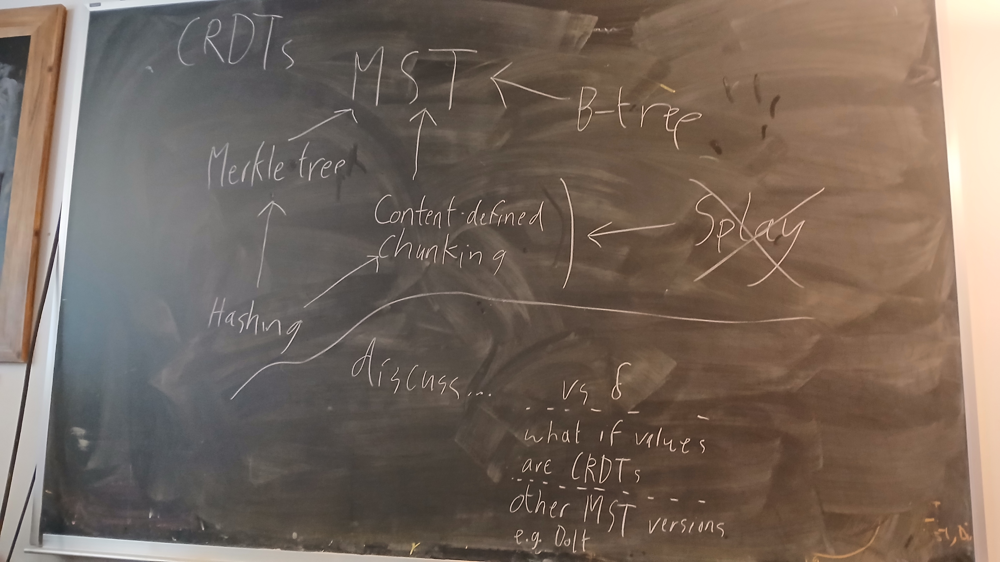

# Merkle Search Trees

## Notes

Did a sketch of MST explanation and talked about where to go from there. Tasks:

- Rough-or-better write-up of the “dependency” explanations. Break down content-defined chunking into something manageable and don’t get lost down the rabbit hole.

## Actual writing

### MST overview
(assumes all prereq knowledge; should be at the end of all this, but I wrote it first)

<!-- NOTE there are many different versions of MSTs. I am gonna focus on the dolthub version and can talk about others later if needed. If Jim or Marcus disagree then I'll deal with it then. -->
There are many different constructions of a Merkle Search Tree and many different names for the same idea; we'll use the design from DoltHub. See discussion for more about the diffferent kinds.

A Merkle Search Tree is a combo Merkle tree and B-tree that uses content-defined chunking to determine block boundaries. To begin, a content-defined chunker is applied to the key-value pairs in sequence. Once the output of the function gets below some threshold, we draw a chunk line and restart the chunking after that line.
<!-- TODO image good, scribble something on the board or steal dolt's -->
Once chunks have been determined, those are the leaves of the tree --- the places where actual the actual key-value data live. Now we take a hash of each chunk (which will act as a pointer to that block) and concatenate them into another large stream. Then we do the whole chunk-and-hash step again, and again, and again, until there is only one block at the top (the chunker didn't draw any lines in the middle of the hash stream). That's the root of the tree!
By annotating the edges with metadata on what value ranges are in those subtrees, we get a searchable tree (like a B-tree) that can efficiently find keys in logarithmic time. Using hashes as pointers for all of this (like a Merkle tree) means the entire structure is self-verifying and not dependent on the machine or environment it's on. And content-defined chunking gives a unique MST representation for a given set of items that will still be (probabilistically) balanced.

### B-trees

A B-tree is a self-balancing search tree with (usually) larger blocks than a binary search tree.

More formally, a B-tree is parameterized by an order $k$ that determines the number of children. Each block has at most $k$ children, and (besides in very small trees) has a minimum of $\lceil k / 2 \rceil$ children.
When inserting a key into the map, it first goes into a leaf node. If that causes the number of keys in the leaf to become $k$ (meaning it would have $k+1$ children), we split the leaf. The middle key $m$ goes up into the parent node, the smaller keys go into a left child node of $m$, and the larger keys go into a right child node of $m$. (If $k$ is even then we arbitrarily choose which of the two middle keys to raise.) If $m$ causes the parent to become too large, repeat the process recursively.
Similarly, when deleting you first remove the deleted key; then if the node is too small, merge it into the parent node and recurse accordingly.

A B-tree can be seen as a generalization of a binary search tree with nicer properties. If you experiment with this (order $k = 3$ is a good example), you will see that this structure is self-balancing --- the merging and splitting rules keep all leaves at the same height.
<!-- NOTE should I actually provide proof? Not really important for what I'm trying to explain, so probably no, Will come back to this later -->
Additionally, the larger block size is more efficient than a binary tree in most computers because modern devices load large blocks of data at a time no matter what. Having wider blocks shortens the tree height, which has no asymptotic effect but significantly improves practical performance.

<!-- TODO why do we care about B-trees? Explain why I just wrote all that. -->
<!-- For our purposes, B-trees --> 

### Merkle Trees

A merkle tree is a tree of hash pointers to other hash nodes, ending in leaves of actual data that is verified by the hashes.

To construct a merkle tree, start with some data (e.g. a series of files). For each data block $x_i$, compute its hash $h_i = H(x_i)$ with some hash function $H$. Then construct a binary tree from the bottom up, recursively hashing pairs of hashes. For example, the parent of $h_1$ and $h_2$ (denoted $h_{1,2}$) stores $H(h_1||h_2)$, the hash of $h_1$ concatenated with $h_2$. And then its parent $h_{1,2,3,4} = H(h_{1,2}||h_{3,4})$, and so on. Eventually this leads to one root pointer, with possibly some padding at the end of the data stream to get to a power of two.

<!-- TODO add scribble image or copy Erica's slide -->
Merkle trees use hashes to verify data integrity. Say a server is storing some files $f_1, \dots, f_n$ for a client. The client only stores the root hash of this Merkle tree (constructed when the files were first given to the server), and the server can store the whole tree or recompute it on the fly. Now the client requests $f_3$ and wants to know if the file is the same as when first sent. By requesting $h_4$, $h_{1,2}$, $h_{5,6,7,8}$, and so on, the client can recompute the branch of the Merkle tree from bottom up until it gets to the root. If the computed root hash equals the old, stored-by-client hash, we know that (with very high probability) the file sent to the client is the exact same as when the client first sent it to the server. This only requires communication between the client and the server that is logarithmic in the number of files stored, and constant storage for the client (just store the original root hash).

TODO talk about other merkle tree uses. It's really just a nice example of hashing

### Content-defined Chunking

TODO

## Old(?) notes and stuff
I wanna keep it around, but right now I just gotta write anew.

### Overview of MST

<!-- Anyways, explain the Merkle Search Tree paper. (Maybe use Dolt's version and prove those properties?) Do a ton of explaining and walk-through. Drive the main point: it's a key-value search tree that efficiently stores diffs. Talk about how this relates to state-based CRDTs, delta-CRDTs, and a nice way to represent it all if we use this content-addressing thing. -->

One of the biggest issues with state-based CRDTs is that the entire state needs to be shared in order to merge. This is fine with smaller states such as a number, but if the state is a list with thousands or millions of items it will quickly become prohibitive.

One approach to fix this is $\delta$-CRDTs. TODO should those go in the background? I don't need to cover them in detail, just explain them. In particular, why are we _not_ using them?

Another approach is taken by CITE PAPER for a tree-based key-value set, called a Merkle Search Tree (MST). They use a clever design to ensure that a given collection of keys and values has a unique representation; then trees can be compared by hashes of their roots and (subsequently) subtrees' roots to find the actual difference between the trees.

<!-- NOTE should I use the original paper's version or the Dolt version? Document it if it's the Dolt version -->

<!-- recap/overview -->
Since a given collection of key-value pairs has a unique representation as an MST, we can easily compare two peers' trees by comparing their root hashes. If equal, the trees are equal and we do no more work. If not equal, we can compare every single child hash and only continue down the paths that differ. If the difference between the two trees is large, there will still be a large amount of work necessary to share the difference between the peers. But the work is asymptotically proportional to the difference of the trees, not the whole tree size.

<!-- what do we gain from this? Recap the usefulness and go from there into "next steps" -->
That's pretty cool! What's the point? It gives us efficient state merge with large states.
<!-- It also means we get a cross-machine "pointer" which is pretty cool. -->

The MST is pretty cool because a given state (set of items) always has a unique representation; furthermore, it's efficient to use. If I want to make other CaRDTs, this is what matters.

### Background info

B-tree, Merkle tree, content-defined chunking. Idk whether this stuff belongs in a separate chapter or here, but either way it's gotta get written.

### MST construction details

<!-- should I put e.g. rolling hashes in the general background section? -->

explain it

analysis/proofs

### Discussion

- compare with delta-crdts
- what kinds of crdts can we make with this underlying structure? talk about the keys and the values and e.g. last-writer-wins reconciliation.
- discuss some range of other MST constructions: Inria, Dolt, XetHub, bup...

### What comes next (what I'm doing with this)

What else can we do with this idea? Some ideas. Some info is duplicated rn.

- Make other data types like this (unique representation via hash)
  - We can also adapt the MST to other container structures. A "range tree" (used by the fast crdt guy) is a fine way to represent a list, where each key is the index and value is the character. (Or maybe we ignore the "keys" altogether and just store the data, indexing with metadata?) It's not the most efficient but it definitely works. And maybe we can optimize the storage nicely or something idk.
- Improve the chunking somehow. Not sure exactly how but surely there's a way.
- Further improve the update latency by optimistically sending over each modification as we get it (along with old & new hashes, path in tree, etc). Can fall back on original transfer protocol when needed.

- We can make other data structures with an MST, e.g. a list as a kind of range tree. That could be cool and useful. Or we could implement a new system from scratch! The important part is the unicity of representation. Can we make a "file?" What does that look like — an array of bytes, a list of strings, a syntax tree based on some grammar, or what?
- Re: MST's future ideas. Is there some way we can do MST data transfer in an op-like way, sending over just what changed? Then we could swap between state-based and op-based info sharing depending on context. Ooooh, the op-based system could send the full tree path of what changed (including old and new hashes) and reconciliation could happen fully on the destination. This feels like it reduces the communication latency a lot. Ooooooh.
- Also we could swap back and forth between the op-based system (send over each change as it happens) and the state-based system (send over root hash and do the full tree comparison every time) depending on speed and divergence and all that.

What’s my overarching point, the thesis of my thesis? Something like...

- Distributed systems are cool/important
- CRDTs are useful for them
- This MST thing solves some distributed systems problems (examples in the real world)
- Here’s how we can make it more flexible and/or powerful and/or etc, also just look it’s a great thing
