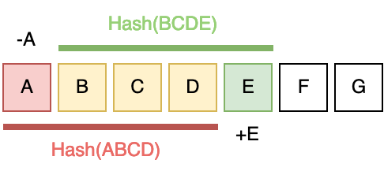

# Prolly Trees

## Notes/todos

IDEA maybe I reflow this a bit.

- Start section with narrative explanation and brief description.
- Then go on to hashing (moved from background), then merkle trees, then content-defined chunking. That flows nicely and ends at "look we could get a content-defined merkle tree."
- Then finally discuss search trees and how this content-defined merkle tree already has nice properties like balancing.

Maybe!

Don't need to actually explain B-trees. Should talk about (desirable properties of) search trees in general, and can mention B-trees as an example of a search tree that has these properties.

Also, I feel confident using the Dolt version of the tree — it has fewer weird questions like “what if there’s a big hash level gap” or whatever. (And I keep going back and forth about the merits of the MST vs Prolly tree, but I just gotta pick something.) Also it gives me more room to do proofs about operation runtime and such. I will definitely discuss the differences and merits of each approach (MST vs Prolly Tree) in a later discussion.

### misc stuff for next chapter

One of the biggest issues with state-based CRDTs is that the entire state needs to be shared in order to merge. This is fine with smaller states such as a number, but if the state is a list with thousands or millions of items it will quickly become prohibitive.

One approach to fix this is $\delta$-CRDTs. TODO should those go in the background? I don't need to cover them in detail, just explain them. In particular, why are we _not_ using them?

Prolly Trees mean we get a cross-machine "pointer" which is pretty cool.

## ACTUAL WRITING

## B-trees

A B-tree is a self-balancing search tree with (usually) larger blocks than a binary search tree.

More formally, a B-tree is parameterized by an order $k$ that determines the number of children. Each block has at most $k$ children, and (besides in very small trees) has a minimum of $\lceil k / 2 \rceil$ children.
When inserting a key into the map, it first goes into a leaf node. If that causes the number of keys in the leaf to become $k$ (meaning it would have $k+1$ children), we split the leaf. The middle key $m$ goes up into the parent node, the smaller keys go into a left child node of $m$, and the larger keys go into a right child node of $m$. (If $k$ is even then we arbitrarily choose which of the two middle keys to raise.) If $m$ causes the parent to become too large, repeat the process recursively.
Similarly, when deleting you first remove the deleted key; then if the node is too small, merge it into the parent node and recurse accordingly.

A B-tree can be seen as a generalization of a binary search tree with nicer properties. If you experiment with this (order $k = 3$ is a good example), you will see that this structure is self-balancing --- the merging and splitting rules keep all leaves at the same height.
<!-- NOTE should I actually provide proof? Not really important for what I'm trying to explain, so probably no. Will come back to this later -->
Additionally, the larger block size is more efficient than a binary tree in most computers because modern devices load large blocks of data at a time no matter what. Having wider blocks shortens the tree height, which has no asymptotic effect but significantly improves practical performance.

For our purposes, B-trees are search trees that are self-balancing and efficient block sizes. A Prolly Tree is like a B-tree with some additional measures for comparing trees.

## Merkle Trees

A Merkle tree is a tree of hash pointers to other hash nodes, ending in leaves of actual data that is verified by the hashes.

To construct a Merkle tree, start with some data (e.g. a series of files). For each data block $x_i$, compute its hash $h_i = H(x_i)$ with some hash function $H$. Then construct a binary tree from the bottom up, recursively hashing pairs of hashes. For example, the parent of $h_1$ and $h_2$ (denoted $h_{1,2}$) stores $H(h_1||h_2)$, the hash of $h_1$ concatenated with $h_2$. And then its parent $h_{1,2,3,4} = H(h_{1,2}||h_{3,4})$, and so on. Eventually this leads to one root pointer, with possibly some padding at the end of the data stream to get to a power of two.

<!-- By Azaghal - Own work, CC0, https://commons.wikimedia.org/w/index.php?curid=18157888 -->

Merkle trees use hashes to verify data integrity. Say a server is storing some files $f_1, \dots, f_n$ for a client. The client only stores the root hash of this Merkle tree (constructed when the files were first given to the server), and the server can store the whole tree or recompute it on the fly. Now the client requests $f_3$ and wants to know if the file is the same as when first sent. By requesting $h_4$, $h_{1,2}$, $h_{5,6,7,8}$, and so on, the client can recompute the branch of the Merkle tree from bottom up until it gets to the root. If the computed root hash equals the old, stored-by-client hash, we know that (with very high probability) the file sent to the client is the exact same as when the client first sent it to the server. This only requires communication between the client and the server that is logarithmic in the number of files stored, and constant storage for the client (just store the original root hash).

For our purposes, Merkle trees illustrate a very useful feature of hashing: a mostly-unique, stable identifier of some content. This is verifiable and directly tied to the referenced content --- if the hash of the content does not equal the hash pointer, something has gone wrong. In the prolly tree, this lets us store easily-comparable references to data. If the root hashes of two Prolly Trees are equal, the tree data is almost certainly the same; if they are not equal, then the trees differ in some way. And we can follow this same logic down the tree to compare subtrees.

## Content-defined Chunking

Chunking is the process of breaking up a large sequence of data into smaller blocks, or chunks.
It's commonly used for storing large amounts of data, since there are often duplicated blocks between large files. Instead of storing the large file directly, it stores a series of pointers to chunks. Then if any chunks are shared between files, there's no duplicated data.

The simplest form of chunking is fixed-length: draw a dividing line every $k$ bytes and those are the blocks. This is a useful deduplication system, but doesn't take full advantage of data similarity. What if we have two files that are almost the same, but one has an extra character at the start?

<!-- https://joshleeb.com/posts/content-defined-chunking.html -->

This means we're sharing nothing between the two versions, even though they have almost the same contents. To fix this, we employ _content-defined chunking_.
This means we find some way of determining chunk boundaries (when to draw a line between chunks) based on the actual contents being chunked.

How can this be done? The common solution is with hashing. The hash of a chunk will always be the same, since hash functions are deterministic. However, it is pseudorandom and doesn't follow any nice pattern like "every $k$ bytes we draw a line;" this actually is beneficial in this case.
<!-- NOTE I don't love this explanation/wording but whatever -->

To do content-defined chunking, then, we first run a hash function $H$ on the first part of data (say the first byte $b_1$). If its output is below some threshold value, draw a chunk boundary and start again with just $H(b_2)$. If the output is not below that boundary, we increase the hash window size --- now we compute $H(b_1b_2)$ and see whether _that_ falls under the threshold. Repeat until at the end of the data.

In practice, this naive approach is inefficient because we are potentially re-hashing some units of data (in this case bytes) many times over. To solve this, there are _rolling hash functions_ which can efficiently "slide their window" so we don't re-calculate hashes for anything.

<!-- https://joshleeb.com/posts/content-defined-chunking.html -->

Content-defined chunking is a very useful tool in general for data deduplication. But it's especially important when you expect to have a lot of very similar data. In a Prolly Tree, content-defined chunking is the final piece of the puzzle. For each search item, instead of fixed block sizes (like in a B-tree), we use CDC to decide chunks of the keys. This is far more efficient for storing multiple versions of a tree, and on average changing the data in one part of the tree won't much affect the chunking of another part of the tree.

## Prolly tree overview

There are many different constructions of a Prolly Tree and many different names for the same idea; we'll use the design from DoltHub. See discussion for more about the diffferent kinds.

A Merkle Search Tree is a combo Merkle tree and B-tree that uses content-defined chunking to determine block boundaries. To begin, a content-defined chunker is applied to the key-value pairs in sequence. Once the output of the function gets below some threshold, we draw a chunk line and restart the chunking after that line.
<!-- image good, scribble something on the board or steal dolt's -->
Once chunks have been determined, those are the leaves of the tree --- the places where actual the actual key-value data live. Now we take a hash of each chunk (which will act as a pointer to that block) and concatenate them into another large stream. Then we do the whole chunk-and-hash step again, and again, and again, until there is only one block at the top (the chunker didn't draw any lines in the middle of the hash stream). That's the root of the tree!
By annotating the edges with metadata on what value ranges are in those subtrees, we get a searchable tree (like a B-tree) that can efficiently find keys in logarithmic time. Using hashes as pointers for all of this (like a Merkle tree) means the entire structure is self-verifying and not dependent on the machine or environment it's on. And content-defined chunking gives a unique prolly tree representation for a given set of items that will still be (probabilistically) balanced.

<!-- old recap/overview, can delete probably -->
Since a given collection of key-value pairs has a unique representation as an MST, we can easily compare two peers' trees by comparing their root hashes. If equal, the trees are equal and we do no more work. If not equal, we can compare every single child hash and only continue down the paths that differ. If the difference between the two trees is large, there will still be a large amount of work necessary to share the difference between the peers. But the work is asymptotically proportional to the difference of the trees, not the whole tree size.

## Comparison of similar structures
(Currently informal thoughts)

There are so many parallel inventions of the same thing. Read the blog posts for more fun info. Generally, most constructions are like Dolt's prolly tree; MST is a bit of an outlier. In terms of design, the prolly tree is more like "start with a Merkle tree and then do CDC to get unicity and then annotate with keys for searchability." (There are the non-searchtree inventions which don't do that last step.) On the other hand, MST is like "start with a search tree and then use hashing to deterministically decide item height, also backsolve & annotate with block pointers." I find that the prolly tree approach is a bit more intuitive and has the hash structure built in which I like. But really you can do anything! DoltHub uses prolly trees. BlueSky uses MST. It's whatever. We're using prolly tree.

Perhaps here is the best naming. The thing that Inria did is a Merkle Search Tree. Content-defined Merkle Trees are exactly that --- a Merkle tree with content-defined chunking, but no search keys. And a Prolly Tree is when you add search keys on top of that.
